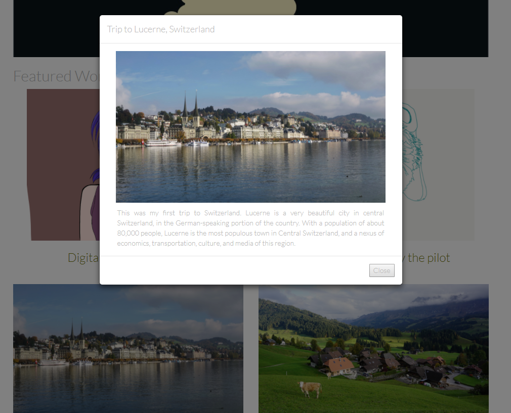

# Simple-Portfolio-Website-Project (with Bootstrap)
 
## Project Overview
This website utilizes a grid based layout such that the body has an element that serves as a container for rows and columns.
All content is responsive and displays on all display sizes. (Desktop, Tablet, Mobile)

#### Display on Desktop:

---
#### Display on Mobile:

---
#### Click one of the Featured Works to open the Modal Box: 

---
**Reference**
- [CSS Validator](https://jigsaw.w3.org/css-validator/#validate_by_input)
- [HTML Validator](https://validator.w3.org/#validate_by_input)
